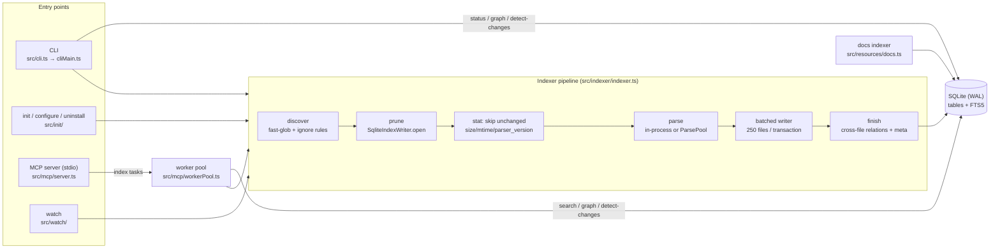

# Architecture

`bitrix-mcp` is one npm package (`@mb4it/bitrix-mcp`) with two faces: a CLI (`bitrix-mcp <command>`) and a local MCP server (`bitrix-mcp serve`, stdio). Both share one indexer and one SQLite database per project, `<project>/.bitrix-mcp/bitrix-mcp.sqlite`. Everything runs locally; the only network access is cloning the official docs and the optional embeddings service.

This page is a map for contributors. User-facing behaviour is documented in [docs/](./docs/); setup and conventions are in [CONTRIBUTING.md](./CONTRIBUTING.md).

## Data flow

In words: an entry point resolves `RuntimePaths` (`src/config/paths.ts`: workspace, data dir, Bitrix root, docs paths, feature flags from env), then either indexes (writes the database) or queries it. The MCP server never touches SQLite on its main thread; it forwards every tool call to worker threads.

## Components

### CLI (`src/cli.ts`, `src/cliMain.ts`, `src/cli/args.ts`)

- `cli.ts` installs the `node:sqlite` experimental-warning filter (`src/runtime/sqliteWarning.ts`) and then dynamically imports `cliMain.ts`, so the filter is active before SQLite loads.
- `cli/args.ts` declares every option once (`OPTIONS`) and each command's allowed subset (`COMMANDS`), parsed with `node:util` `parseArgs` in strict mode. Unknown options and extra positionals are usage errors (exit code 2); `<command> --help` never runs the command.
- `cliMain.ts` imports heavy modules (MCP SDK, indexer, SQLite store, init, benchmark) **inside** the command branches with `await import(...)`, so `--version`, `--help` and argument errors return in well under 100 ms. The language parsers (TypeScript compiler, php-parser) load on the first parsed file (`src/indexer/parseFile.ts`), so read-only commands such as `status` never load them.
- Progress for `index-*` goes to stderr through `src/progress/` reporters (TTY, compact, JSON Lines, no-op), selected by `createProgressReporter`.

### init / configure / uninstall (`src/init/`)

- `init.ts`: resolves the target agents (prompt, `--agent`, `--all-agents`, `--yes`), writes each client's MCP server entry, the guidance rule file, the skill, and context-injection hooks, then (for `init`) builds missing indexes and optionally serves.
- `configFiles.ts`: the only place that writes config files. JSON/JSONC is edited surgically with `jsonc-parser` (only managed keys change, comments survive); Codex TOML replaces one table block. A one-time `<file>.bak` is written before the first change to an existing file. `withDryRun()` records writes instead of performing them (via `AsyncLocalStorage`) — `init/configure --dry-run` prints them with a unified diff from `diff.ts`.
- `uninstall.ts`: removes only what carries bitrix-mcp's markers (server entry, `bitrix-mcp:auto-directive` hooks, `bitrix-mcp:init-guidance` sections, skills).

### MCP server and worker pool (`src/mcp/`)

- `server.ts` registers tools (with zod input schemas), resources (`bitrix-docs://…`), and annotations (`annotations.ts`: read-only vs. destructive; destructive calls ask for approval through MCP elicitation when the client supports it).
- Every tool body is a `WorkerTask` sent through `toolGuards.ts` → `workerPool.ts`:
  - **read** tasks (search, graph, detect-changes, overview, …) run on a shared pool of long-lived worker threads (`BITRIX_MCP_WORKERS`, default 2), with a 30 s timeout;
  - **index** tasks run one at a time behind an `AsyncMutex`, each in its own worker, with the heavy timeout (10 min) and progress notifications relayed from the indexer;
  - **heavy** tasks (`bitrix_tinker`, `bitrix_db_execute`) also get their own worker and the heavy timeout.
  Cancellation or timeout terminates the worker, and a crashed worker fails its call immediately.
- `worker.ts` is the task dispatcher inside a worker (`workerThread.ts` is the thread entry; stdout is redirected to stderr there because stdout belongs to the stdio transport). `format.ts` shapes results into compact or `full` JSON.

### Indexer pipeline (`src/indexer/indexer.ts`)

`buildIndex(options)` indexes one **scope** (`kind`): `project` (your code, never `bitrix/**` or `local/{modules,templates,components,js}`), `template` (site templates and components), `bitrix` (curated core allowlist: `bitrix/modules/**/*.php`, admin, tools, core JS, `local/modules`, `local/js`; module selection from `bitrixModules.ts`), and `install` (module `install/` assets, minus `install/js`).

1. **Discover** — `discoverFiles` globs the scope's patterns with fast-glob, then filters with built-in ignores (`node_modules`, `vendor`, `dist`, `cache`, `upload`, `test`, `.bitrix-mcp`, …), secret-file patterns (`src/config/secrets.ts`), `lang/**` unless `--include-lang`, `.gitignore` (project/template only) and `.bitrixmcpignore`.
2. **Prune** — `SqliteIndexWriter.open` deletes indexed files of this kind that are under the **scanned root** but no longer discovered (or all of them with `--force`). Indexing one template directory never touches the others.
3. **Stat** — files whose size, mtime and `parser_version` match the stored row are skipped without being read.
4. **Parse** — `parseFile.ts` dispatches on language: PHP through `src/liveapi/phpParser.ts` (php-parser AST with a regex fallback, plus the Bitrix-specific extractors for events, agents, mail events, ORM, IBlock/HL-block, options, module includes, components, call sites) and JS/TS through `src/liveapi/jsParser.ts` (TypeScript compiler API). Runs with ≥ 200 changed files use `ParsePool` (`parsePool.ts` / `parseWorker.ts`, `BITRIX_MCP_INDEX_WORKERS`, default CPUs − 1 capped at 4), pipelined so the next window parses while the current one is written.
5. **Write** — parsed files are written 250 per transaction (`BEGIN IMMEDIATE`), so readers are never blocked for a whole run and memory stays bounded (`retainSymbols: false` drops parsed records after each batch).
6. **Finish** — rebuilds cross-file relations (mail events) and records `index:<kind>` metadata and warnings. The project scope also indexes Composer/Bitrix autoload metadata (`autoload.ts`).

`src/indexer/actions.ts` composes scopes (`indexCode`, `indexAll`), and holds `status`/`doctor`. `src/indexer/template.ts` maps a template path to index options with workspace-relative paths. `src/watch/` maps file-system changes to the smallest scope directory and re-runs `buildIndex` on it (see [docs/cli.md#watch-mode](./docs/cli.md#watch-mode)).

Documentation is indexed separately by `src/resources/docs.ts`: sources (local paths, Git checkouts under `.bitrix-mcp/docs-sources/`) are registered in `doc_sources`, Markdown/text files are split into heading-aware chunks with extracted symbol references, and re-indexed incrementally by size/mtime.

### SQLite store (`src/indexer/store/`, facade `src/indexer/sqliteStore.ts`)

`node:sqlite` `DatabaseSync` in WAL mode; `database.ts` opens every connection with a 5 s `busy_timeout` and `synchronous = NORMAL`.

| Module | Responsibility |
| --- | --- |
| `schema.ts` | DDL and migrations, tracked by `PRAGMA user_version` = `SCHEMA_VERSION`; run at most once per database per process. `PARSER_VERSION` is stored per file row. |
| `writer.ts` | `SqliteIndexWriter`: prune, incremental file writes (files, symbols, events, usages, ORM, call sites, relations + FTS rows), finish. |
| `relations.ts` | Derives graph edges from symbols and files (event handlers, agents, mail events, components/templates, module includes, inheritance); canonical node types (`class:<FQN>` for classes, interfaces and traits). |
| `fts.ts` | FTS5 table definitions, tokenization helpers, bm25 weights, and rebuild of outdated FTS tables. |
| `queries.ts` | Search/lookup queries used by tools (relations, components, ORM, usages, call sites, …). |
| `status.ts` | Index status, project overview, reading an index back as a manifest. |
| `indexedRecords.ts` | Everything indexed for a set of files (used by detect-changes and impact radius). |
| `docs.ts` | Documentation chunk storage and doc ↔ symbol references. |
| `rows.ts`, `types.ts` | Row mapping and shared types. |

### Full-text search

FTS5 tables `symbols_fts`, `events_fts` and `docs_fts` are **contentless** (`content=''`, `contentless_delete=1`): the text lives in the base tables and the FTS row shares the base row's id, so deletes stay cheap. Code tables add a `tokens` column with identifier parts (camelCase, namespaces, snake_case: `CIBlockElement` → `iblock`, `element`), the docs table a `stems` column with Russian stemming plus the porter tokenizer for English (`src/search/textTokens.ts`). `src/liveapi/search.ts` merges exact-name and prefix hits (NOCASE indexes) with bm25-ranked FTS hits, in tiers, with an optional boost for project/template results. Semantic docs search is an optional external Python service (`embeddings/`, `src/search/embeddingsClient.ts`).

### Graph (`src/indexer/graph.ts`)

`bitrix_relations` is the canonical edge table (`source_type/source_name → target_type/target_name`, `relation_type`, file/line). Neighbors, traversal and impact radius are bounded BFS over it: depth and result limits are clamped (neighbors ≤ 5 levels, traversal ≤ 8, ≤ 1000 results), a visited set makes traversal cycle-safe, and frontier lookups are chunked `IN (…)` queries on the NOCASE indexes. Impact radius starts from changed files, their relation endpoints and their symbols' nodes, and runs one multi-source BFS. See [docs/graph.md](./docs/graph.md).

### Detect changes (`src/indexer/detectChanges.ts`, `gitChanges.ts`)

Lists Git changes (`git diff` against a validated base plus untracked files), classifies files by Bitrix kind, reads what the index holds for them, computes a symbol-level diff (before state from the index when the index row is stale, otherwise from a fresh parse of the file at the Git base), runs impact radius, and scores risk (events, agents, deleted symbols, signature changes, impact edges). See [docs/detect-changes.md](./docs/detect-changes.md).

### Live DB, tinker, and security layers

- **DB** (`src/db/`, opt-in with `BITRIX_MCP_DB_ENABLED`): credentials come from `bitrix/.settings.php` / `.settings_extra.php` (`src/liveapi/settingsPhpParser.ts`, parsed as PHP AST, never executed). `sqlGuard.ts` lexes SQL and allows one read-only statement for `bitrix_db_query`; it then runs in a `READ ONLY` transaction with a server-side time limit, streamed row and byte caps (`mysqlClient.ts`). Writes need `BITRIX_MCP_DB_ALLOW_WRITE` and the destructive `bitrix_db_execute` tool. An optional `SELECT`-only account can be configured.
- **Tinker** (`src/php/tinker.ts`, opt-in with `BITRIX_MCP_TINKER_ENABLED`): writes the snippet and a runner script (which loads `bitrix/modules/main/include/prolog_before.php`) to a private temp directory and runs the PHP CLI with an allowlisted environment, a timeout (SIGTERM, then SIGKILL), and output caps.
- **Files**: secret files (DB settings, license key, `.env`, keys, dumps) are never indexed or returned by read tools unless `BITRIX_MCP_ALLOW_SECRET_FILES=1`; file-context reads are restricted to the workspace and data directory; MCP project/template indexing rejects paths outside the workspace unless `BITRIX_MCP_ALLOW_OUTSIDE_WORKSPACE=1`.

See [docs/security.md](./docs/security.md) for the threat model.

## Conventions worth knowing

- Stored and user-visible relative paths are slash-normalized (`/`) on every platform.
- Re-indexing is always incremental; nothing forces a full rebuild except `--force`, a `PARSER_VERSION` bump (re-parses every file once) or an FTS layout change (rebuilds the FTS tables).
- Only `bitrix_relations` rows are graph edges; graph code must stay bounded and cycle-safe.
